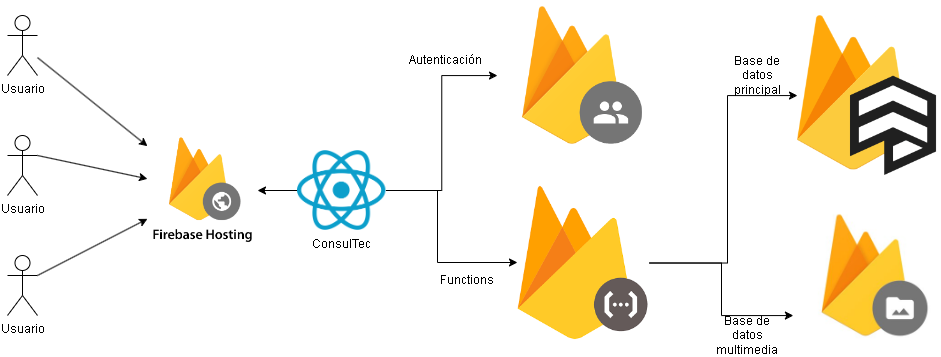

# Consultec
The project involves the creation of a website where students from the School of Mathematics at the Costa Rica Institute of Technology can make queries, view exercise examples, study course materials, grade responses from professors, and access other functionalities related to the various courses offered by the school. This tool will enable students to reinforce their knowledge in the field of mathematics, while providing professors with a centralized space to address inquiries from the entire student population. 

